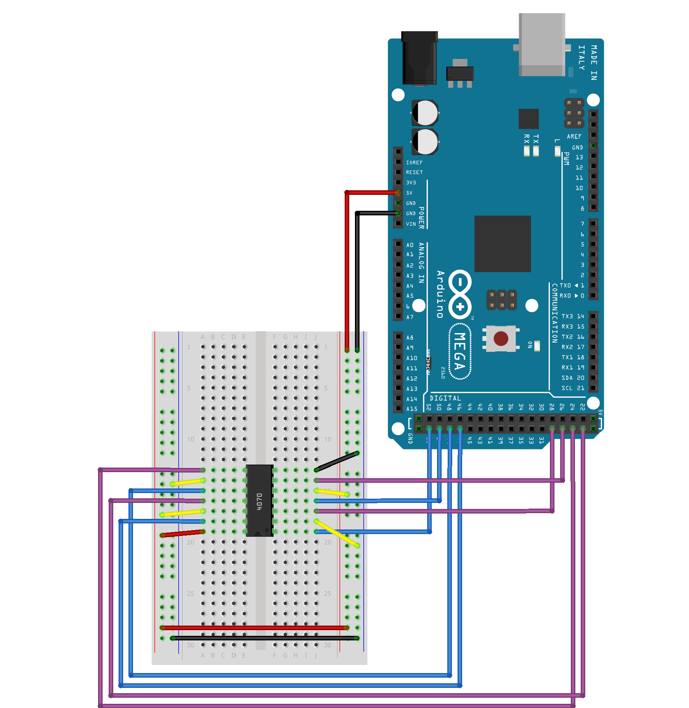
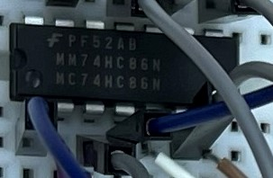

# Dweeno

```
We found this wack program running on an Arduino Mega using some spider-looking thing on a breadboard. The information we need is redacted in the program we found, but we managed to grab the serial output from the program. Help us figure out what this information is! 
```

## Challenge

We are given the program source code, output of the program along with a photo and diagram of the hardware setup. We are suppose to figure out how the hardware processes the flag text so we can reverse it.

Looking at the program source code:

```c
char * flag = "REDACTED";
String curr, first, second;
int in1=29, in2=27, in3=25, in4=23;
int out1=53, out2=51, out3=49, out4=47;
int i;

String get_output(String bits) {
    String output;
    digitalWrite(out1, ((bits[0] == '1')? HIGH : LOW));
    digitalWrite(out2, ((bits[1] == '1')? HIGH : LOW));
    digitalWrite(out3, ((bits[2] == '1')? HIGH : LOW));
    digitalWrite(out4, ((bits[3] == '1')? HIGH : LOW));
    delay(1000);
    output += String(digitalRead(in1));
    output += String(digitalRead(in2));
    output += String(digitalRead(in3));
    output += String(digitalRead(in4));
    return output;
}

//converts a given number into binary
String binary(int number) {
  String r;
  while(number!=0) {
    r = (number % 2 == 0 ? "0" : "1")+r; 
    number /= 2;
  }
  while ((int) r.length() < 8) {
    r = "0"+r;
  }
  return r;
}

void setup() {
  i = 0;
  pinMode(out1, OUTPUT);
  pinMode(out2, OUTPUT);
  pinMode(out3, OUTPUT);
  pinMode(out4, OUTPUT);
  pinMode(in1, INPUT);
  pinMode(in2, INPUT);
  pinMode(in3, INPUT);
  pinMode(in4, INPUT);
  Serial.begin(9600);
}

void loop() {
  if (i < strlen(flag)) {
    curr = binary(flag[i]);
    first = curr.substring(0,4);
    second = curr.substring(4,8);
    Serial.print(get_output(first));
    Serial.println(get_output(second));
    delay(1000);
    i++;
  }
}

```

In `loop()` we can see that it processes the flag text character by character and splits them into two 4-bit halves every iteration. We can see at `get_output()` no processing is done on the code side, we need to look at the hardware. We take note of the output and input pin mappings: `in1=29, in2=27, in3=25, in4=23; out1=53, out2=51, out3=49, out4=47;`

Taking at look at the output, we can see that it is just binary strings, as expected reading the program code:

```
00110011
00111001
00110100
00110010
00101110
00110100
01100100
01100011
00110111
01101101
01100101
01100111
01100010
00110110
00110011
01100110
01100010
01100001
00110111
01100100
01100100
01100000
00110011
01100010
00110110
01100110
00110000
01100111
00110011
01100011
01100111
01100111
00110001
01101101
01100001
00110111
00110110
00101000
```

Looking at the diagram and tracing it, we notice that no rearrangement of the bits are done, every output pin is matched with its corresponding input pin.



This means we need to know what the integrated circuit (IC) is doing, and thus we look at the photo to find the specifications:



Googling the codes, we find that it corresponds to [this IC](https://www.digchip.com/datasheets/parts/datasheet/311/MC74HC86N-pdf.php).

From the datasheet we can understand that the IC performs a XOR of two different inputs, up to four pairs at a time. Knowing this, we can look which of the bits are XOR'ed with Voltage (5V) which is HIGH meaning 1 or Ground (GND) which is LOW, meaning 0. We double check from the code that the output encoding that 1s are HIGH and 0s are LOW.

With this we can simply write a python script to reverse the process without having to construct the corresponding hardware:

```py
filename="./output.txt"

def convert(binary):
    result = ""
    result += "1" if binary[0] == "1" else "0" # stay (XOR with 0)
    result += "0" if binary[1] == "1" else "1" # flip (XOR with 1)
    result += "1" if binary[2] == "1" else "0" # stay (XOR with 0)
    result += "0" if binary[3] == "1" else "1" # flip (XOR with 1)
    return result

with open(filename) as file:
    flag = ""
    while line := file.readline():
        reversed = convert(line[0:4]) + convert(line[4:8])
        
        # convert binary to ascii
        n = int(reversed,2)
        flag += n.to_bytes((n.bit_length() + 7) // 8, 'big').decode()
    print(flag)
```

Flag: `flag{a16b8027cf374b115f7c3e2f622d84bc}`
