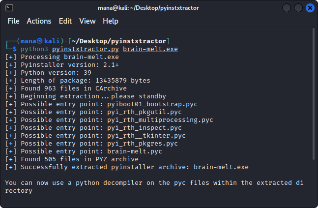

# Brain Melt

```
Have fun and find the flag :)
```

## Challenge

> TL;DR: Extract `.pyc` from executable using `pyinstxtractor`, and decompile `pyc` using `pycdc`.

By running `strings` on the executable, we can see strings of python indicating that this is likely a `PyInstaller` file.

```
zPYZ-00.pyz
'python39.dll
```

First, we extract the compiled python bytecodes using [PyInstaller Extractor](https://github.com/extremecoders-re/pyinstxtractor).

<br>

Next, as Python 3.9 is used for this executable, the standard `uncompyle6` would not work and we will have to use [`Decompyle++`](https://github.com/zrax/pycdc) to decompile the bytecodes. The decompiled source code we get from decompiling `brain-melt.pyc` can be seen [here](files/brain-melt.py).

The flag seems to be obfuscated and can be decrypted and can be printed out using the `decrypt` and `deobfuscate` functions. Just `print` the result from these functions to get the flag.

```py
import base64

def decrypt(s1, s2):
    return ''.join((lambda x: [ chr(ord(c1) ^ ord(c2)) for c1, c2 in x ])(zip(s1, s2)))

def deobfuscate():
    part1 = '2ec7627d{galf'[::-1]
    part2 = str(base64.b64decode('NjIwM2I1Y2M2OWY0'.encode('ascii')), 'UTF8')
    part3 = decrypt('\x17*\x07`BC\x14*R@\x14^*', 'uKeVuzwIexplW')
    key = part1 + part2 + part3
    return key

print(deobfuscate())
```

Flag: `flag{d7267ce26203b5cc69f4bab679cc78d2}`