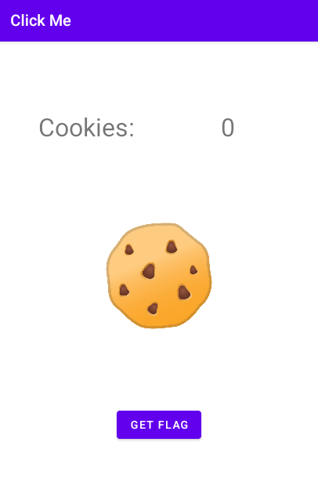

# Click Me!

```
I created a cookie clicker application to pass the time. There's a special prize that I can't seem to get.
```

## Challenge

> TL;DR: Set the clicks to 99999999 and get flag, and use `frida` instead.

<br>

Examining the decompiled source code of the APK with `JADX`, in `MainActivity` we can see a `getFlagButtonClick` function where it will show a toast text if the current clicks is `99999999`. However, this cannot be brute-forced with an auto clicker as it seems that the clicks will be locked once it reaches `13371337` in the previous function.

```java
public final void cookieViewClick(View view) {
	int i = this.CLICKS + 1;
	this.CLICKS = i;
	if (i >= 13371337) {
		this.CLICKS = 13371337;
	}
	((TextView) findViewById(R.id.cookieCount)).setText(String.valueOf(this.CLICKS));
}

public final void getFlagButtonClick(View view) {
	Intrinsics.checkNotNullParameter(view, "view");
	if (this.CLICKS == 99999999) {
		Toast.makeText(getApplicationContext(), getFlag(), 0).show();
		return;
	}
	Toast.makeText(getApplicationContext(), "You do not have enough cookies to get the flag", 0).show();
}
```

This can be solved easily with `frida`, but stupid me didn't have `frida` installed in this computer so I decided to go the `CheatEngine` way in mobile using [`GameGuardian`](https://gameguardian.net/).

First, we do a few clicks in the app and search for the exact click value in the memory using `GameGuardian`, increase the clicks and repeat the process until 1 address is returned (should take no more than 3 tries).

<br>

Modify the memory value to `99999999` and return back to the app and click on the `Get Flag` button.

<br>

The flag should now appear as a toast message.

<br>

Flag: `flag{849d9e5421c59358ee4d568adebc5a70}`
