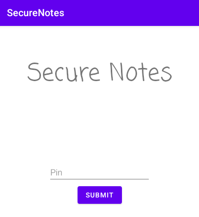
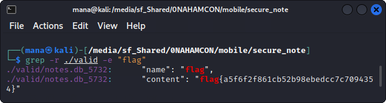

# Secure Notes

```
None of the free note taking app offer encryption... So I made my own!
```

## Challenge

> TL;DR: Brute force pin to decrypt note.

<br>

Examining the decompiled source code of the APK with `JADX`, in `LoginActivity` we can see a function where it seems to create a new `notes.db` file with the `d.k()` function. The function seems to concatenate the string from the `textview` (most probably our pin field) 4 times to act as a password to this function.

```java
public void onClick(View view) {
    try {
        d.k(this.f1583b.getText().toString() + this.f1583b.getText().toString() + this.f1583b.getText().toString() + this.f1583b.getText().toString(), new File(this.f1584c.getPath()), new File(LoginActivity.this.getCacheDir(), "notes.db"));
        LoginActivity.this.startActivity(this.f1585d);
    } catch (p0.a unused) {
        Toast.makeText(LoginActivity.this.getApplicationContext(), "Wrong password", 0).show();
    }
}
```

Navigating to source code of the `d.k()`, we can see that it is an AES decryption function:

```java
public static void k(String str, File file, File file2) {
    try {
        SecretKeySpec secretKeySpec = new SecretKeySpec(str.getBytes(), "AES");
        Cipher instance = Cipher.getInstance("AES");
        instance.init(2, secretKeySpec);
        FileInputStream fileInputStream = new FileInputStream(file);
        byte[] bArr = new byte[((int) file.length())];
        fileInputStream.read(bArr);
        byte[] doFinal = instance.doFinal(bArr);
        FileOutputStream fileOutputStream = new FileOutputStream(file2);
        fileOutputStream.write(doFinal);
        fileInputStream.close();
        fileOutputStream.close();
    } catch (IOException | InvalidKeyException | NoSuchAlgorithmException | BadPaddingException | IllegalBlockSizeException | NoSuchPaddingException e2) {
        throw new a("Error encrypting/decrypting file", e2);
    }
}
```

Now, as the pin is only 4 digits, we can bruteforce this combination and try to decrypt our encrypted database which can be found in the `assets/database/db.encrypted` by extracting it from the APK using unzip. Below is a Java code reusing some of the app source code to brute force:

```java
import java.io.File;
import java.io.FileInputStream;
import java.io.FileOutputStream;
import java.io.IOException;
import java.security.InvalidKeyException;
import java.security.NoSuchAlgorithmException;
import java.util.WeakHashMap;
import javax.crypto.BadPaddingException;
import javax.crypto.Cipher;
import javax.crypto.IllegalBlockSizeException;
import javax.crypto.NoSuchPaddingException;
import javax.crypto.spec.SecretKeySpec;

public class brute_decrypt {
	public static void main(String[] args) {
		File file1 = new File("assets/databases/db.encrypted");
		File file2 = new File("./notes.db");	
		
		for (int i = 0; i <= 9999; i += 1) {
			String pin = String.format("%04d", i);
			//System.out.println(pin);
			
			// Pin is concatenated 4 times as AES key
			k(pin + pin + pin + pin, file1, file2);
		}
		System.out.println("End");
	}
	public static void k(String str, File file, File file2) {
		try {
			SecretKeySpec secretKeySpec = new SecretKeySpec(str.getBytes(), "AES");
			Cipher instance = Cipher.getInstance("AES");
			instance.init(2, secretKeySpec);
			FileInputStream fileInputStream = new FileInputStream(file);
			byte[] bArr = new byte[((int) file.length())];
			fileInputStream.read(bArr);
			byte[] doFinal = instance.doFinal(bArr);
			FileOutputStream fileOutputStream = new FileOutputStream(file2);
			fileOutputStream.write(doFinal);
			fileInputStream.close();
			fileOutputStream.close();
			
			// Print if successful
			String pin = str.substring(0, 4);
			System.out.println(pin);
			file2 = new File("./valid/notes.db_" + pin);
			fileOutputStream = new FileOutputStream(file2);
			fileOutputStream.write(doFinal);
			fileOutputStream.close();
		} catch (IOException | InvalidKeyException | NoSuchAlgorithmException | BadPaddingException | IllegalBlockSizeException | NoSuchPaddingException e2) {
			//System.out.println("Error encrypting/decrypting file" + e2);
		}
	}
}
```

By compiling with `javac` and running with `java brute_function brute_function.class`, it outputs around 40 valid pins. Not sure why this is happening but there may be a bug somewhere, but due to laziness, just run `grep -r ./valid -e "flag"` and get our flag. We can also see that the actual valid pin is `5732`.

<br>

Flag: `flag{a5f6f2f861cb52b98ebedcc7c7094354}`
