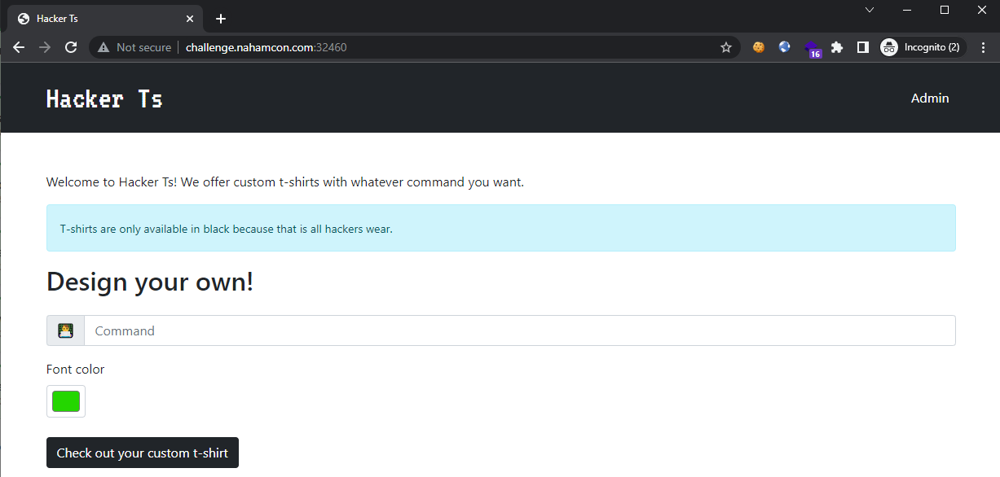
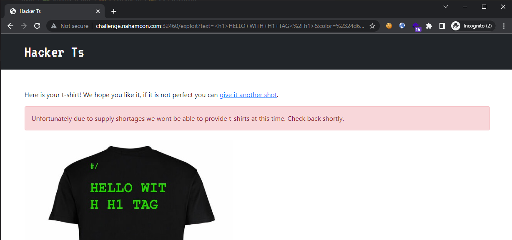
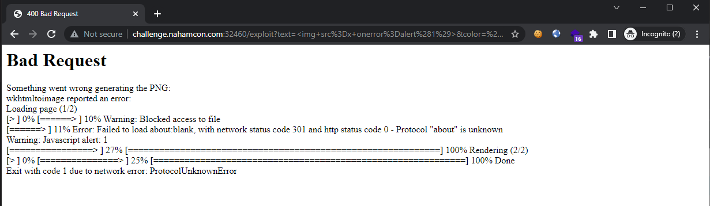
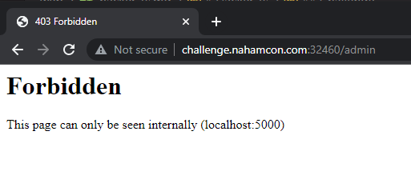
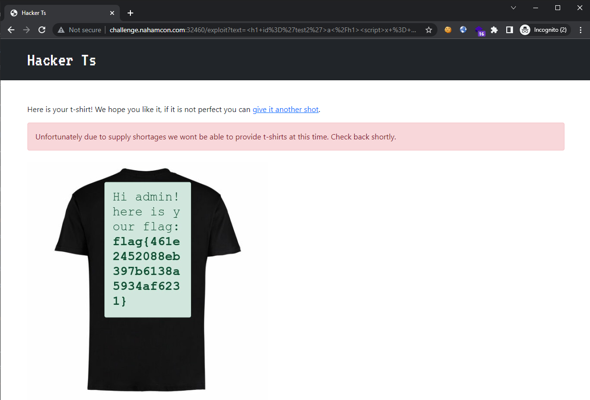

# Hacker Ts

```
We all love our hacker t-shirts. Make your own custom ones.
```

## Challenge

> TL;DR: SSRF vulnerability in [wkhtmltopdf](https://wkhtmltopdf.org/) library

Examining the challenge site, it appears that we are able to generate a T-shirt with any writing we want from the input box:



Trying out HTML injection, we were able to get some success:



However, attempting to inject "dangerous" tags such as `` resulted in an error being shown:



Revealing that the backend is using [wkhtmltopdf](https://wkhtmltopdf.org/) to generate the final output by converting HTML to PDF. Searching up for known vulnerabilities, it appears that this library is [susceptible to SSRF vulnerabilities](https://portswigger.net/daily-swig/html-to-pdf-converters-open-to-denial-of-service-ssrf-directory-traversal-attacks), as it will execute JavaScript code during its conversion process.

Since we also see an "Admin" link at the challenge page, which responded that it only allows localhost, we can attempt to direct our SSRF payload there and retrieve its contents:



So we inject a JavaScript payload that fetches from that page. This would work since the following [CORS](https://developer.mozilla.org/en-US/docs/Web/HTTP/CORS) header is found on the challenge site:

```http
Access-Control-Allow-Origin: *
```

Which means that what would normally be disallowed: cross-domain access from `http://challenge.nahamcon.com:32460/` to `http://localhost:5000/`, would be allowed.

The final payload is thus:

```html
<h1 id='test2'>a</h1>
<script>
  x = new XMLHttpRequest();
  x.open('GET','http://localhost:5000/admin',false);
  x.send();
  document.getElementById('test2').innerHTML= x.responseText;
</script>
```

Resulting in the flag being retrieved from the `http://localhost:5000/admin` page:



(unfortunately, this was an image so we had to type the flag manually)

Flag: `flag{461e2452088eb397b6138a5934af6231}`
