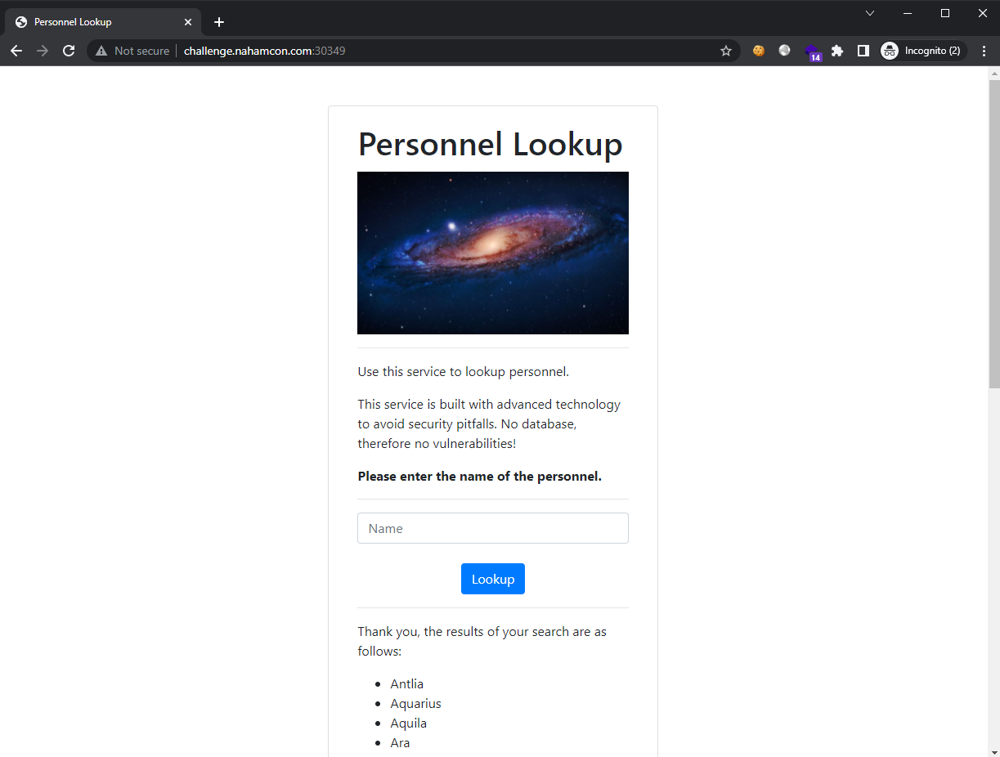
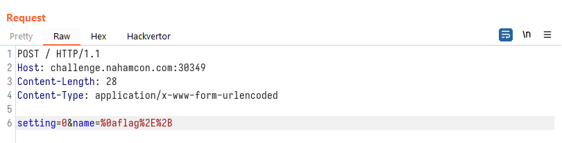
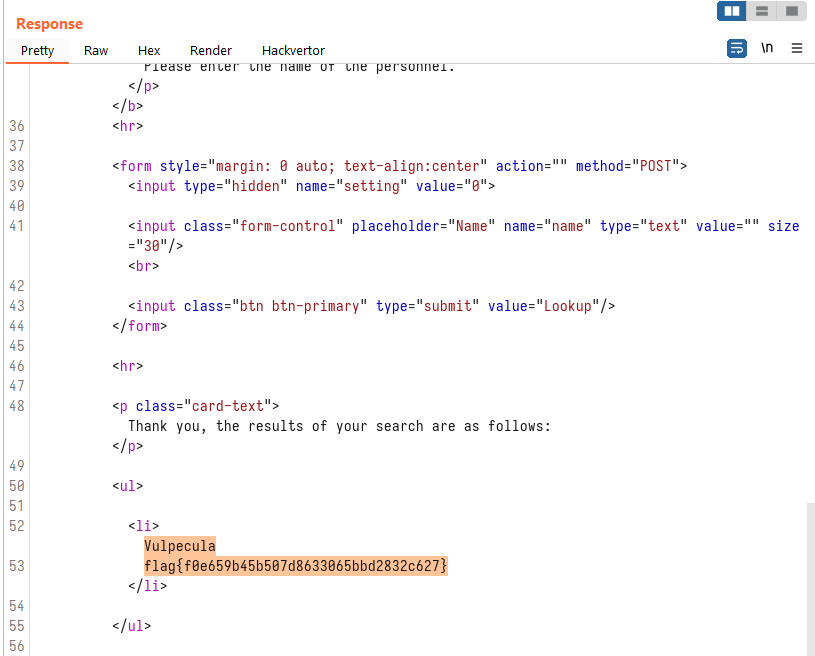

# Personnel

```
A challenge that was never discovered during the 2021 Constellations mission... now ungated :)
```

## Challenge

> TL;DR: Regex pattern injection

Visiting the challenge site and verifying in the source page, we see that the only clear path is via the text field:



It appears to do a substring search from a list. Since we are given the partial source code for this challenge, we can attempt to find the goal for this challenge.

```py
# app.py

flag = open("flag.txt").read()
users = open("users.txt").read()
users += flag # [1]

@app.route("/", methods=["GET", "POST"])
def index():
    if request.method == "GET":
        return render_template("lookup.html")
    if request.method == "POST":
        name = request.form["name"] # [2]
        setting = int(request.form["setting"])
        if name:
            if name[0].isupper():
                name = name[1:]

        results = re.findall(r"[A-Z][a-z]*?" + name + r"[a-z]*?\n", users, setting) # [3]
        results = [x.strip() for x in results if x or len(x) > 1]

        return render_template("lookup.html", passed_results=True, results=results) # [4]
```

At [1], we see that the `users` variable is populated with a bunch of names and the flag (in this order, this is an important point). In [2], our search request parameter `name` is saved in the `name` variable. Finaly, at [3], the `name` variable is used as part of a regex search string where the results are returned and displayed in [4].

We are unable to simply query for "flag" since the starting part of the regex is `[A-Z][a-z]*?` which expects the match to start with an uppercase letter.

Since we know the flag is at the bottom of the list, there is likely a name that starts with an uppercase letter before the flag. So for our input, we can set it as:

```
\nflag.+
```

which makes the final regex become:

```
[A-Z][a-z]*?\nflag.+[a-z]*?\n
```

This means that we would first match for a name starting with an uppercase letter, followed by a new line, followed by the word `flag` and any character as many times until a new line is matched again.

Sending our request with the injected input (url-encoded):



We see the flag in the response, which is prepended by a name starting with an uppercase character:



Flag: `flag{f0e659b45b507d8633065bbd2832c627}`
